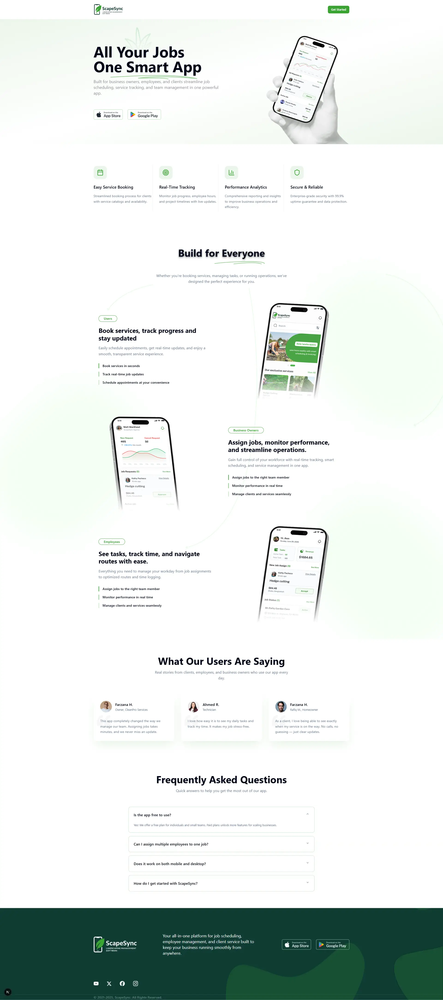

# SpaceSync 🚀

**All Your Jobs One Smart App** - A comprehensive business management platform built for service providers, employees, and clients to streamline operations and enhance productivity.


*Professional service management made simple*

## 🌟 Overview

SpaceSync is a powerful, all-in-one business management application designed to revolutionize how service-based businesses operate. Whether you're a business owner managing a team, an employee tracking your daily tasks, or a client booking services, SpaceSync provides the perfect experience tailored to your needs.

### 🎯 Key Features

- **📅 Easy Service Booking** - Streamlined booking process with service catalogs and real-time availability
- **📊 Real-Time Tracking** - Monitor job progress, employee hours, and project timelines with live updates
- **📈 Performance Analytics** - Comprehensive reporting and insights to optimize business operations
- **🔒 Enterprise Security** - Bank-level security with 99.9% uptime guarantee and data protection
- **🌐 Cross-Platform** - Works seamlessly on mobile and desktop devices

## 🎭 User Roles & Benefits

### 👥 For Users (Clients)
- Book services in seconds with intuitive interface
- Track real-time job updates and progress
- Schedule appointments at your convenience
- Transparent communication with service providers

### 🏢 For Business Owners
- Assign jobs to the right team members efficiently
- Monitor team performance in real-time
- Manage clients and services seamlessly
- Access comprehensive analytics and reports
- Streamline operations with smart scheduling

### 👷 For Employees
- View daily tasks and assignments clearly
- Track time and log hours accurately
- Navigate optimized routes for field work
- Communicate updates in real-time
- Manage workday efficiently

## 🛠️ Tech Stack

### Frontend
- **Next.js 15.5.4** - React framework with App Router
- **React 19.1.0** - Latest React with concurrent features
- **TypeScript** - Type-safe development
- **Tailwind CSS 4.0** - Utility-first CSS framework
- **Shadcn/ui** - Modern component library

### UI Components & Libraries
- **Radix UI** - Unstyled, accessible components
- **Lucide React** - Beautiful, customizable icons
- **React Toastify** - Toast notifications
- **Class Variance Authority** - Component variant management

### Authentication & API
- **NextAuth.js** - Authentication solution
- **Axios** - HTTP client for API requests
- **EmailJS** - Email service integration

### Development Tools
- **Turbopack** - Fast bundler for development
- **ESLint** - Code linting and formatting
- **PostCSS** - CSS processing

## 🚀 Getting Started

### Prerequisites
- Node.js 18+ 
- npm or yarn package manager
- Git

### Installation

1. **Clone the repository**
   ```bash
   git clone https://github.com/yourusername/spacesync.git
   cd spacesync
   ```

2. **Install dependencies**
   ```bash
   npm install
   # or
   yarn install
   ```

3. **Set up environment variables**
   ```bash
   cp .env.example .env.local
   ```
   Configure your environment variables:
   ```env
   NEXTAUTH_URL=http://localhost:3000
   NEXTAUTH_SECRET=your-secret-key
   DATABASE_URL=your-database-url
   EMAIL_SERVICE_ID=your-emailjs-service-id
   EMAIL_TEMPLATE_ID=your-emailjs-template-id
   EMAIL_USER_ID=your-emailjs-user-id
   ```

4. **Run the development server**
   ```bash
   npm run dev
   # or
   yarn dev
   ```

5. **Open your browser**
   Navigate to [http://localhost:3000](http://localhost:3000) to see the application.

## 📁 Project Structure

```
spacesync/
├── app/                    # Next.js App Router
│   ├── (auth)/            # Authentication pages
│   ├── dashboard/         # Dashboard pages
│   ├── api/               # API routes
│   └── globals.css        # Global styles
├── components/            # Reusable components
│   ├── ui/                # Shadcn/ui components
│   ├── forms/             # Form components
│   └── layout/            # Layout components
├── lib/                   # Utility functions
├── hooks/                 # Custom React hooks
├── types/                 # TypeScript type definitions
├── public/                # Static assets
└── screenshots/           # Project screenshots
```

## 🚢 Deployment

The application is deployed on Vercel and can be accessed at:
**🌐 [https://spacesync-theta.vercel.app/](https://spacesync-theta.vercel.app/)**

### Deploy Your Own

1. **Fork this repository**

2. **Deploy to Vercel**
   [](https://vercel.com/new/clone?repository-url=https://github.com/yourusername/spacesync)

3. **Configure environment variables** in your Vercel dashboard

4. **Your app is live!** 🎉

## 📊 Performance Features

- **99.9% Uptime Guarantee** - Reliable service availability
- **Real-time Updates** - Live job tracking and notifications
- **Mobile Responsive** - Optimized for all device types
- **Fast Loading** - Optimized with Next.js and Turbopack
- **SEO Optimized** - Better search engine visibility


## 💬 User Testimonials

> "This app completely changed the way we manage our team. Assigning jobs takes minutes, and we never miss an update."
> 
> **— Farzana H., Owner, CleanPro Services**

> "I love how easy it is to see my daily tasks and track my time. It makes my job stress-free."
> 
> **— Ahmed R., Technician**

> "As a client, I love being able to see exactly when my service is on the way. No calls, no guessing — just clear updates."
> 
> **— Rafiq M., Homeowner**

## ❓ FAQ

**Is the app free to use?**
Yes! We offer a free plan for individuals and small teams. Paid plans unlock more features for scaling businesses.

**Can I assign multiple employees to one job?**
Absolutely! SpaceSync supports team assignments and collaborative job management.

**Does it work on both mobile and desktop?**
Yes, SpaceSync is fully responsive and works seamlessly across all devices.

**How do I get started with SpaceSync?**
Simply sign up, choose your role (Business Owner, Employee, or Client), and start managing your services efficiently.

## 🤝 Contributing

We welcome contributions! Please see our [Contributing Guide](CONTRIBUTING.md) for details.

1. Fork the repository
2. Create a feature branch (`git checkout -b feature/amazing-feature`)
3. Commit your changes (`git commit -m 'Add amazing feature'`)
4. Push to the branch (`git push origin feature/amazing-feature`)
5. Open a Pull Request

## 📄 License

This project is licensed under the MIT License - see the [LICENSE](LICENSE) file for details.

## 🙏 Acknowledgments

- Built with [Next.js](https://nextjs.org/)
- UI components from [Shadcn/ui](https://ui.shadcn.com/)
- Icons by [Lucide](https://lucide.dev/)
- Deployed on [Vercel](https://vercel.com/)


---

